# Архитектура LeadVirt: актуальная схема проекта

Статус: фактическая реализация (as-is)<br>
Дата среза: 2026-07-16<br>
Основная ветка: `main`<br>
Публичный контур: `https://leadvirt.com`

Этот документ описывает текущую реализацию LeadVirt, а не целевую дорожную карту. Для читаемости система разложена на отдельные уровни: контекст, монорепозиторий, runtime, frontend, API, каналы, очереди, AI, Knowledge, данные, безопасность и deployment.

## Как читать схему

- `LIVE` - путь реализован и используется.
- `LIMITED` - реализация есть, но сознательно ограничена или выключена конфигурацией.
- `COMING_SOON` - тип или UI-карточка существуют, но provider-backed операция недоступна.
- PostgreSQL является источником истины. Redis/BullMQ, Qdrant и файловый object store не заменяют авторитетное состояние PostgreSQL.
- Mermaid-блоки рендерятся в GitHub, IDE с Mermaid preview и совместимых Markdown viewer.

## 1. Системный контекст

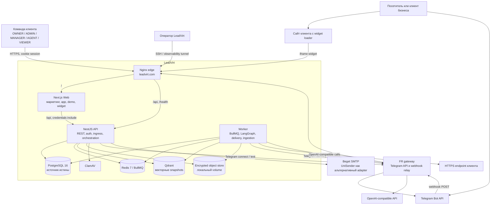

### Главные границы

| Граница | Назначение | Состояние |
|---|---|---|
| `apps/web` | Next.js интерфейс, demo и встраиваемый widget | LIVE |
| `apps/api` | NestJS REST API, auth, RBAC, публичные ingress и управление доменами | LIVE |
| `apps/worker` | Асинхронные AI, доставка сообщений и ingestion Knowledge | LIVE |
| `packages/db` | Prisma schema, client, seed и idempotent migrations | LIVE |
| `packages/runtime-queue` | Durable outbox/inbox и публикация в BullMQ | LIVE |
| `packages/knowledge` | Retrieval, Qdrant, ingestion security, object store и capability policy | LIVE |
| `packages/ai` | AI provider, grounded answer, claim/citation gate | LIVE |
| `packages/integrations` | Telegram, generic webhook и безопасная outbound delivery | LIVE |

## 2. Монорепозиторий и зависимости пакетов

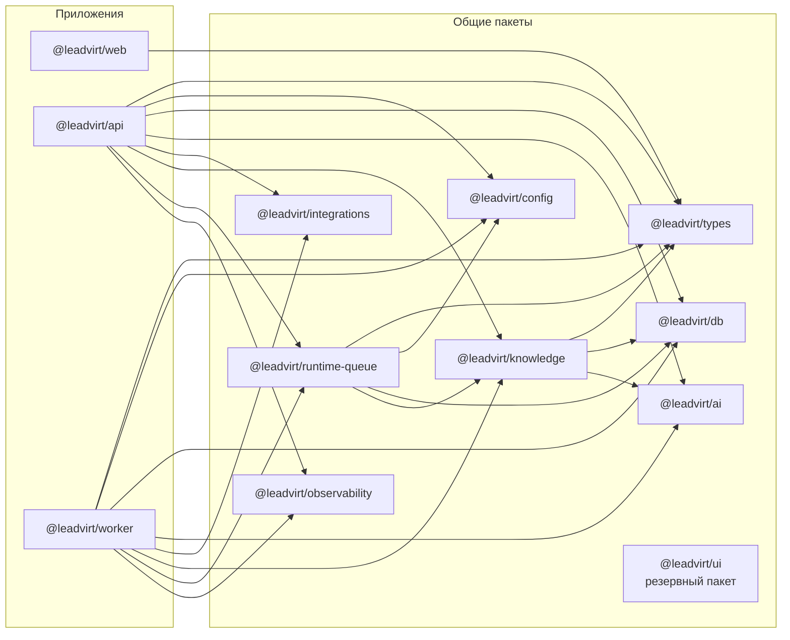

| Путь | Роль |
|---|---|
| `apps/api/src/modules/*` | Модульный монолит NestJS |
| `apps/web/src/app/*` | Next.js App Router |
| `apps/web/src/design/*` | Production UI source of truth |
| `apps/worker/src/processors/*` | Реестр BullMQ processors |
| `packages/db/prisma/schema.prisma` | 96 Prisma models и 93 enum |
| `packages/db/prisma/migrations/*` | 39 миграций |
| `artifacts/playwright/*` | Browser/API acceptance suites |
| `artifacts/scripts/*` | Contract, security, migration и reliability smokes |
| `deploy/*` | Compose, Nginx, TLS и observability |

`packages/ui` существует, но production web сейчас использует локальную систему компонентов из `apps/web/src/design`.

## 3. Production runtime

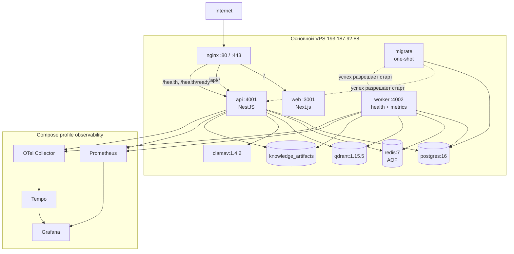

API, worker, web и migrate собираются из одного Node 24/pnpm image, но запускаются разными командами. Секретный env-файл получают только migrate, API и worker. Web получает только build-time public variables.

## 4. Frontend

### 4.1 Обертки и режимы

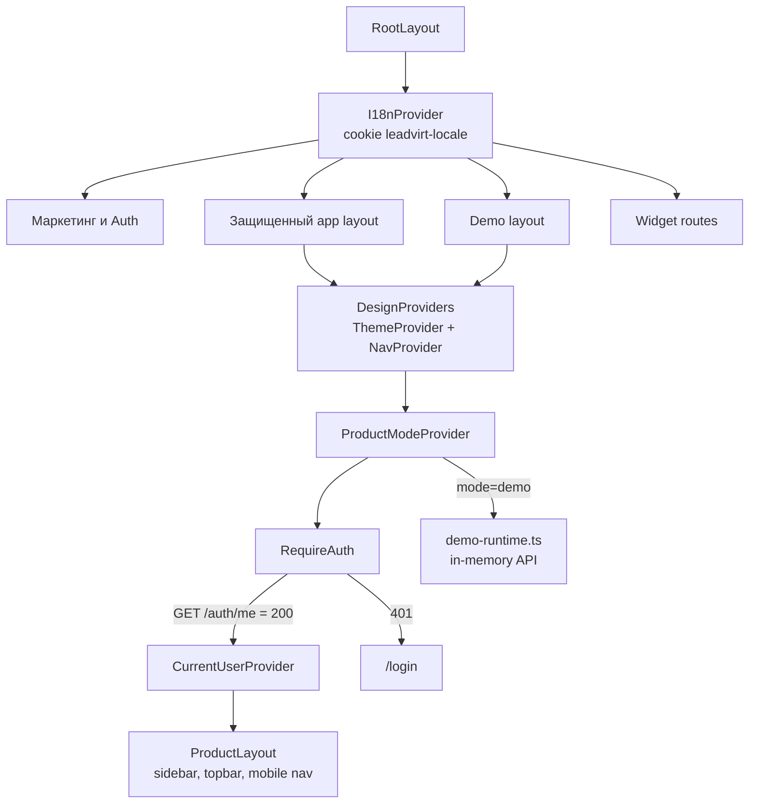

### 4.2 Маршруты

| URL | Экран | Режим и доступ |
|---|---|---|
| `/`, `/features`, `/solutions`, `/pricing` | Landing | публичный |
| `/login`, `/signup` | Email OTP / Telegram AuthFlow | публичный |
| `/forgot-password`, `/reset-password` | Redirect в `/login` | LIMITED: API recovery есть, отдельный UI отключен |
| `/onboarding` | Onboarding | публичная точка входа после новой регистрации |
| `/app` | Dashboard | session required |
| `/app/inbox` | Inbox | session required |
| `/app/inbox/[conversationId]` | Conversation | session required |
| `/app/leads` | Pipeline / CRM | session required |
| `/app/automations` | Workflows | MANAGER+ для управления |
| `/app/analytics` | Analytics | session required |
| `/app/knowledge` | Knowledge workspace | MANAGER+ |
| `/app/audit` | AI audit | MANAGER+ |
| `/app/integrations` | Integrations | тест MANAGER+, управление OWNER/ADMIN |
| `/app/billing` | Settings / Billing | OWNER/ADMIN |
| `/app/settings?tab=...` | Profile, team, channels, notifications, billing, security, API keys | role-aware |
| `/demo/*` | Те же product pages | read-only in-memory demo |
| `/widget/embed.js` | Loader script | публичный |
| `/widget/frame?key=...` | Widget iframe | публичный |

### 4.3 Страница к API

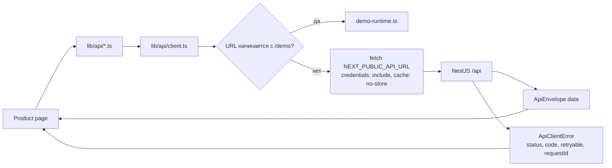

| Экран | API-домены |
|---|---|
| Dashboard | `dashboard`, `current-tenant`, `billing` |
| Inbox / Conversation | `inbox/conversations`, `leads` |
| Pipeline | `leads`, `inbox` |
| Automation | `workflows` |
| Analytics | `analytics` |
| Knowledge | `knowledge/v2` |
| AI audit | `ai-audit` |
| Integrations | `integrations`, `channels` |
| Settings | `settings`, `billing`, `channels` |
| Onboarding | `onboarding`, `knowledge` |

### 4.4 Локализация

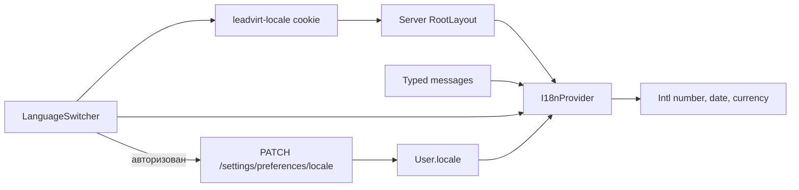

Поддерживаются `en`, `es`, `fr`, `de`, `pt`, `ru`; язык по умолчанию - `en`. Для гостя выбор хранится в cookie, для пользователя дополнительно сериализованно сохраняется в PostgreSQL.

## 5. API как модульный монолит

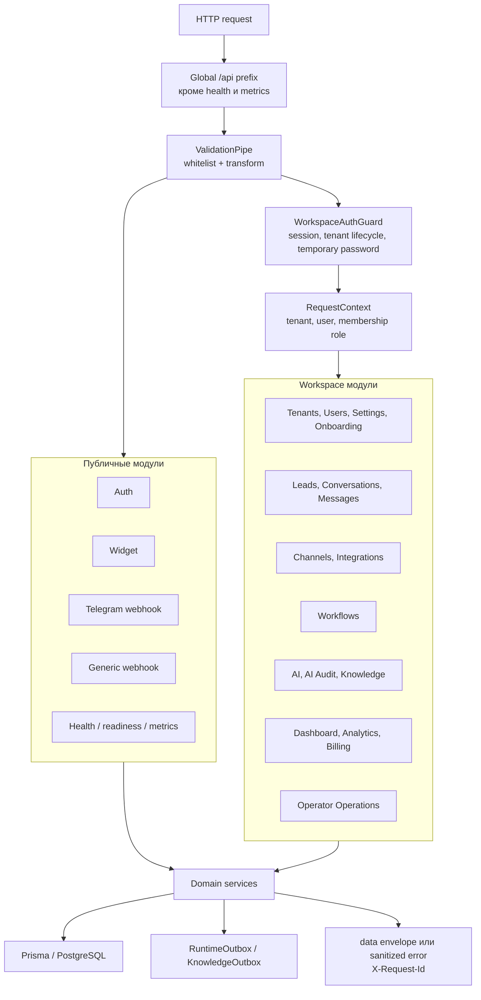

### 5.1 API-каталог

| Prefix | Ответственность |
|---|---|
| `/api/auth/*`, `/api/auth/me` | password, email OTP, Telegram login, logout, password reset |
| `/api/current-tenant` | текущий workspace |
| `/api/dashboard`, `/api/analytics` | агрегаты продукта |
| `/api/inbox/conversations` | inbox, messages, AI draft, assignment, handoff |
| `/api/leads` | pipeline, lead events, task/CRM/booking actions |
| `/api/channels` | каналы, secrets, automatic-reply activation |
| `/api/integrations` | Telegram/Webhook lifecycle и каталог provider |
| `/api/workflows` | CRUD, publish и test |
| `/api/knowledge/v2` | sources, files, facts, guidance, review, tests, evaluations, publications |
| `/api/settings` | account, locale, team, notifications, security, legacy API keys |
| `/api/billing` | plans, subscription, invoices, usage |
| `/api/operator/operations` | reconcile/redrive неоднозначных операций |
| `/api/public/widget` | конфиг и сообщения widget |
| `/api/public/channels/telegram` | Telegram webhook |
| `/api/public/channels/webhook` | generic webhook ingress |
| `/health`, `/health/ready`, `/metrics` | liveness, dependencies, Prometheus |

## 6. Каналы и интеграции

### 6.1 Текущий статус

| Канал / provider | Inbound | Outbound | Self-service | Статус |
|---|---:|---:|---:|---|
| Website Widget | да | ответ в conversation/widget | да | LIVE |
| Telegram Bot | да | да | токен BotFather, webhook автоматически | LIVE |
| Webhook/API | да | HTTPS callback | да | LIVE |
| Email OTP | auth-only | транзакционное письмо | конфигурация сервера | LIVE, не inbox integration |
| WhatsApp, Instagram, VK | нет | нет | нет | COMING_SOON |
| amoCRM, Bitrix24, RetailCRM | нет | нет | нет | COMING_SOON |
| Google Calendar, Shopify, Shop-Script | нет | нет | нет | COMING_SOON |
| Custom provider | нет | нет | нет | COMING_SOON |

Нереализованные providers отклоняют connect, disconnect, settings, test и sample до записи в БД с `501 / INTEGRATION_NOT_AVAILABLE`.

### 6.2 Общий inbound

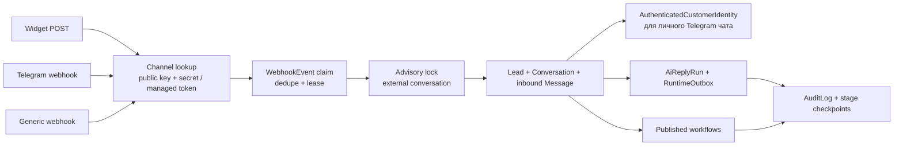

Widget и generic webhook имеют sync fallback при выключенной queue mode. Telegram automatic reply остается queue-only.

### 6.3 Подключение Telegram

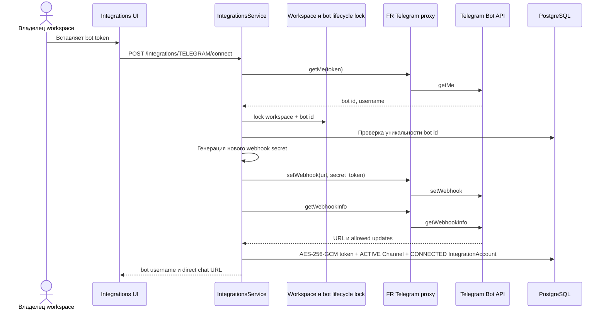

### 6.4 Telegram inbound

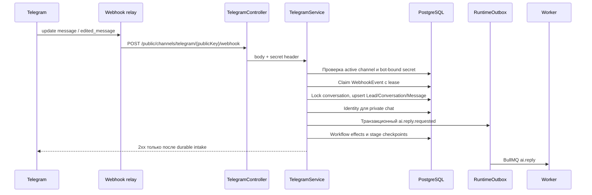

## 7. Очереди и надежность

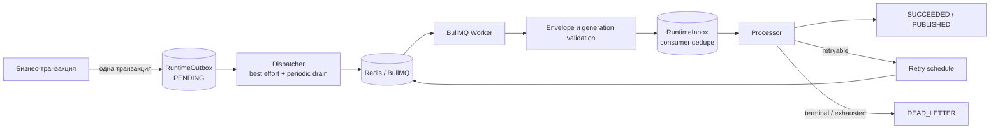

| Queue | Реальный processor | Статус |
|---|---|---|
| `ai.reply` | LangGraph AI reply | LIVE |
| `ai.extractLeadFields` | Извлечение lead fields | LIVE |
| `channels.sendMessage` | Telegram/Webhook delivery | LIVE |
| `knowledge.ingest` | Import, sync, reconcile, delete | LIVE |
| `ai.followUp` | отсутствует | DECLARED ONLY |
| `channels.processWebhook` | отсутствует | DECLARED ONLY |
| `crm.syncLead` | отсутствует | DECLARED ONLY |
| `analytics.aggregate` | отсутствует | DECLARED ONLY |
| `billing.calculateUsage` | отсутствует | DECLARED ONLY |

Processor для неизвестной или объявленной без реализации queue завершает job non-retryable ошибкой. Успешного placeholder-ответа нет.

### 7.1 Fences

- `RuntimeInbox` подавляет повторное выполнение consumer event.
- `generation` и `sequence` отбрасывают superseded AI runs.
- `WebhookEvent` хранит lease и отдельные checkpoints intake/AI/workflow.
- `ChannelDeliveryOperation` фиксирует одну внешнюю попытку по delivery identity.
- Перед provider call worker повторно читает текущие Conversation, Channel, credentials и Knowledge binding.
- Неоднозначный внешний результат остается `UNKNOWN` до provider-specific reconciliation.

## 8. AI runtime

```mermaid
flowchart LR
  Start(["ai.reply"])
  Normalize["normalize_message"]
  Tenant["load_tenant_context"]
  Retrieve["retrieve_context"]
  Intent["intent_classify"]
  Draft["draft_response"]
  Decide["decide_tool_calls"]
  Gate["quality_gate"]
  Tools["execute_tools"]
  Audit["persist_audit"]
  End(["result"])

  Start --> Normalize --> Tenant --> Retrieve --> Intent --> Draft --> Decide --> Gate --> Tools --> Audit --> End
```

### 8.1 Detailed reply path

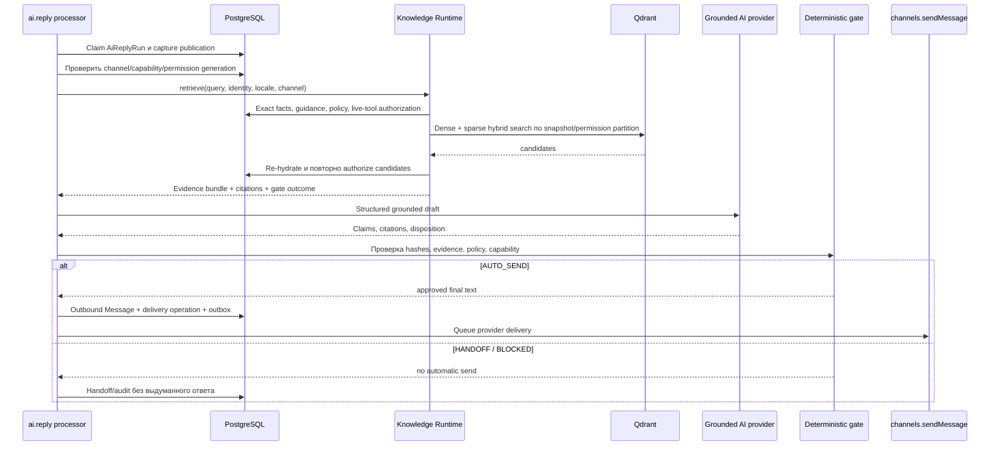

Capability snapshot ограничивает автономность уровнями `ANSWER_ONLY`, `COLLECT_INFORMATION`, `PROPOSE_ACTION`, `ACT_WITH_CONFIRMATION`, `AUTONOMOUS_ACTION`. Runtime обязан подтвердить активную immutable publication и channel binding до ответа и перед доставкой.

## 9. Knowledge V2

### 9.1 Ingestion и publication

```mermaid
flowchart LR
  UI["Knowledge UI / API"]
  Source["Source<br/>manual, website, file, legacy"]
  Admission["URL / MIME / size / permission admission"]
  Scan["ClamAV + content security"]
  Object[("Encrypted object store")]
  Job["KnowledgeJob + outbox"]
  Worker["knowledge.ingest"]
  Parse["Acquire, parse, normalize"]
  Structure["Document, revision, element, chunk"]
  Review["Conflicts + Review queue"]
  Embed["Dense embedding + sparse encoding"]
  Qdrant[("Immutable Qdrant snapshot")]
  Validate["Capability readiness + evaluation"]
  Publication["KnowledgePublication"]
  Active["ActiveKnowledgePublication"]
  Runtime["Runtime Retriever"]

  UI --> Source --> Admission --> Job --> Worker
  Worker --> Scan
  Scan --> Object
  Scan --> Parse --> Structure --> Review
  Structure --> Embed --> Qdrant
  Review --> Validate
  Qdrant --> Validate --> Publication --> Active --> Runtime
```

### 9.2 Состояния

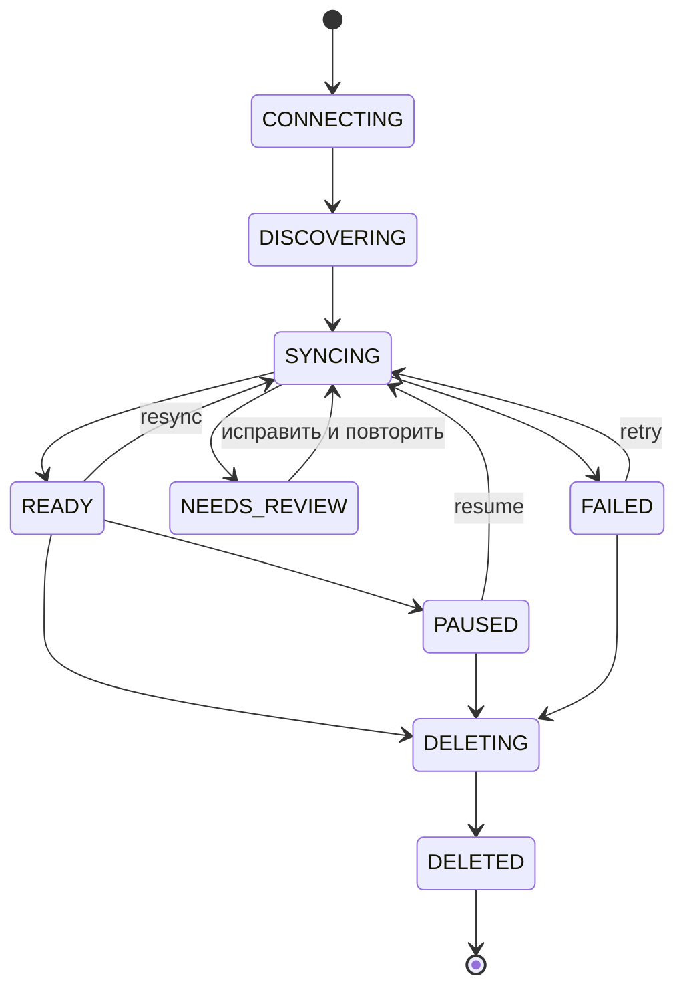

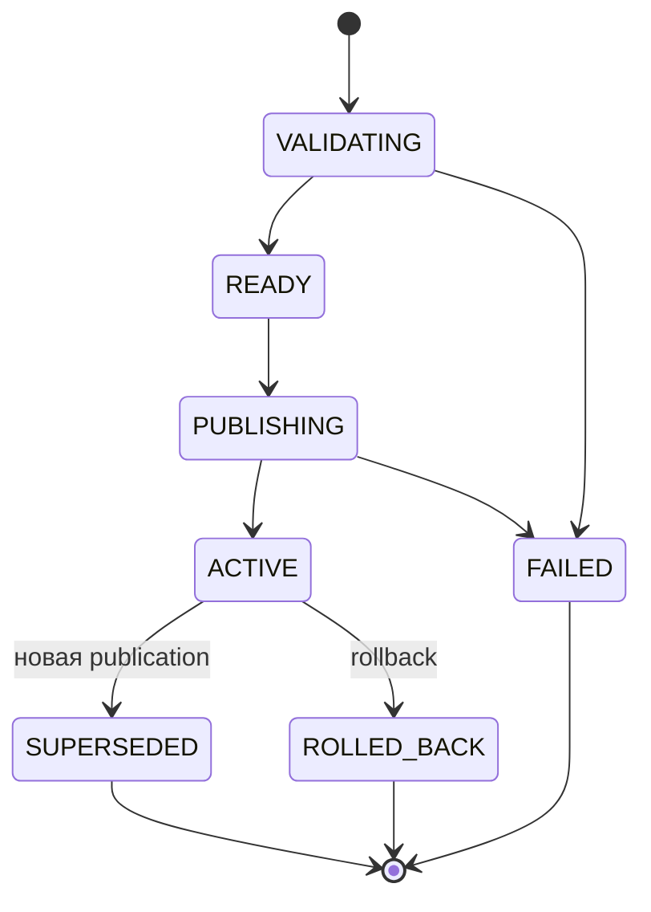

### 9.3 Truth plane

| Слой | Модели |
|---|---|
| Sources и artifacts | `KnowledgeV2Source`, `FileUploadIntent`, `Artifact`, `Document`, `DocumentRevision` |
| Content structure | `Element`, `Chunk`, `IndexSnapshotItem`, `EmbeddingCache` |
| Structured truth | `Entity`, `Fact`, `FactVersion`, `GuidanceRule`, `GuidanceRuleVersion`, `Evidence` |
| Readiness | `Settings`, `Capability`, `RequirementDefinition`, `RequirementEvaluation` |
| Publication | `KnowledgePublication`, `PublicationItem`, `PublicationCapability`, `ActiveKnowledgePublication` |
| Review | `Conflict`, `ConflictCandidate`, `ReviewItem`, evidence links |
| Quality | `TestCase`, `TestCaseVersion`, `TestExpectation`, `EvaluationRun`, `EvaluationResult`, `Metric` |
| Runtime evidence | `RetrievalTrace`, `RetrievalCandidate`, `Citation`, `LiveToolExecution`, `Feedback` |

### 9.4 Security и storage

- Website connector применяет SSRF-защиту, DNS/IP validation, pinned HTTPS и контролируемые redirects.
- TXT/CSV проходят MIME/signature validation и ClamAV; PDF пока блокируется.
- Raw, extracted, embedding и restricted runtime artifacts шифруются AES-256-GCM.
- Object keys не содержат открытых tenant/source имен; защита включает traversal и symlink checks.
- Qdrant фильтрует по workspace, immutable snapshot и permission fingerprint до возврата candidates.
- После Qdrant каждый candidate повторно гидратируется и авторизуется в PostgreSQL.
- `CUSTOMER_PERSONAL`, `SENSITIVE` и `SECRET` fail closed без утвержденного processor policy.

## 10. Аутентификация и роли

### 10.1 Email OTP

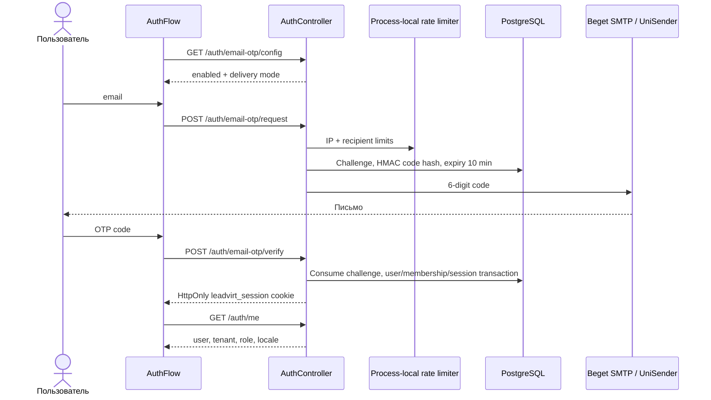

### 10.2 Auth authority

- Browser authority: `HttpOnly` cookie + `/auth/me`; identity не хранится в localStorage.
- В БД хранится SHA-256 hash session token.
- Cookie: 30 дней, `SameSite=Lax`, `Secure` в production.
- Password hash: `scrypt:v1`; TOTP secret зашифрован, recovery codes хэшированы.
- Password reset token одноразовый и хранится как hash; accepted delivery активирует только один token.
- Telegram Login Widget и Telegram OIDC поддерживаются API; текущий AuthFlow использует классический Telegram Login.
- Защищенный request получает `tenantId`, `userId`, `role`, `authMode` через `RequestContext`.

### 10.3 Матрица ролей UI

| Возможность | OWNER / ADMIN | MANAGER | AGENT | VIEWER |
|---|---:|---:|---:|---:|
| Leads и conversations | да | да | да | только просмотр |
| Workflows | да | да | нет | нет |
| Integration management | да | нет | нет | нет |
| Integration test | да | да | нет | нет |
| Account и channels | да | да | нет | нет |
| Team, secrets, billing | да | нет | нет | нет |
| Knowledge и AI audit | да | да | нет | нет |

UI скрывает недоступные действия, но окончательная авторизация всегда выполняется API.

## 11. Модель данных

### 11.1 Core CRM и tenancy

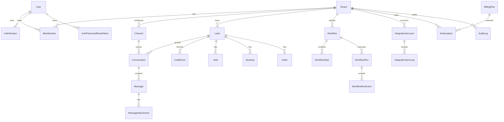

### 11.2 AI и durable operations

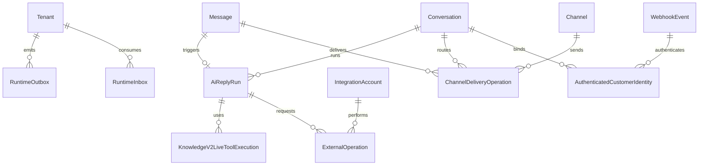

### 11.3 Knowledge data graph

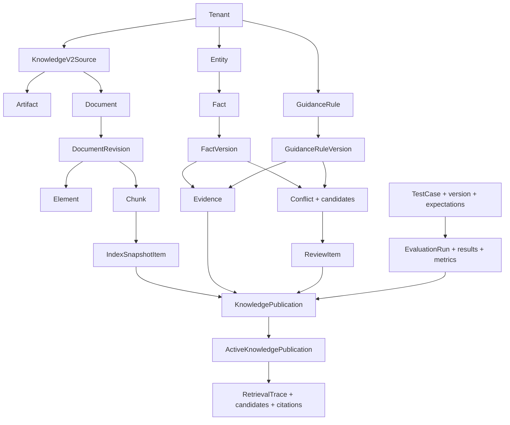

Composite tenant foreign keys, unique identities и immutable triggers не позволяют связывать runtime evidence или publication с объектами другого workspace.

## 12. Deployment и CI/CD

```mermaid
flowchart LR
  Push["Push main/master<br/>или workflow_dispatch"]
  Verify["Verify job<br/>Postgres + Redis + Qdrant"]
  Gates["typecheck, lint, build<br/>contracts, security, acceptance"]
  Archive["Release archive<br/>без env/cache/logs"]
  SSH["SSH upload<br/>193.187.92.88"]
  Lock["Host flock + deployment journal"]
  Release["/opt/leadvirt/releases/{sha-attempt}"]
  Build["Build shared image"]
  Preflight["Isolated API + paused worker + web preflight"]
  Drain["Drain exact prior writers<br/>stop public nginx"]
  Switch["Atomic current symlink switch"]
  Migration["Idempotent migrations"]
  Promote["Candidate-only roll-forward"]
  Health["Public health + key coverage"]
  Prune["Retain 5 proven-unused releases"]

  Push --> Verify --> Gates --> Archive --> SSH --> Lock --> Release --> Build --> Preflight
  Preflight --> Drain --> Switch --> Migration --> Promote --> Health --> Prune
```

Deployment journal разделяет две аварийные зоны:

- до durable `committed` выполняется rollback к точным предыдущим container IDs и current path;
- после `committed` старый код больше не возвращается, выполняется candidate-only roll-forward.

Отдельный protected workflow запускает real-provider multilingual Knowledge gate на staging и загружает content-free report.

## 13. Observability

```mermaid
flowchart LR
  API["API spans + /metrics"]
  Worker["Worker spans + :4002/metrics"]
  OTel["OTel Collector :4318"]
  Tempo[("Tempo<br/>traces")]
  Prom[("Prometheus<br/>metrics + alerts")]
  Grafana["Grafana :3003"]
  Operator["Оператор через SSH tunnel"]

  API --> OTel
  Worker --> OTel
  OTel --> Tempo
  API --> Prom
  Worker --> Prom
  Tempo --> Grafana
  Prom --> Grafana
  Operator --> Grafana
```

Покрываются HTTP routes, dependency readiness, worker jobs, DLQ, AI graph, budget/quality, channel delivery, Knowledge ingestion/publication/retrieval и exporter failures. PII, email, phone и provider tokens редактируются до log/trace.

## 14. Внешние сетевые маршруты

| Откуда | Куда | Маршрут |
|---|---|---|
| Browser | LeadVirt | `https://leadvirt.com` |
| Telegram | FR relay | `https://147-90-14-240.sslip.io:8443/telegram-webhook/*` |
| Main VPS | Telegram API | FR relay `/telegram/*` |
| Main VPS | OpenAI | FR relay root proxy |
| API | Beget SMTP | `smtp.beget.com:465`, implicit TLS |
| API | UniSender | `sendEmail` adapter, альтернативный provider |
| Worker | Webhook клиента | только валидированный публичный HTTPS target |

Gateway разрешает OpenAI/Telegram outbound только с IP основного VPS. Telegram relay принимает только POST, ограничивает размер и rate, а окончательную аутентификацию выполняет bot-bound secret в LeadVirt.

## 15. Известные ограничения текущей реализации

1. PostgreSQL RLS пока выключен. Tenant filters, membership checks и composite tenant FK обязательны; отдельный runtime role `NOBYPASSRLS` еще не введен.
2. Auth rate limiting хранится в process-local `Map`; перед несколькими API replicas его нужно перенести в Redis.
3. Password-reset delivery выполняется синхронно. Public body одинаковый, но provider latency остается потенциальным timing oracle; durable delivery queue запланирована.
4. Отдельные `/forgot-password` и `/reset-password` UI сейчас перенаправляют в login, хотя API recovery реализован.
5. Object store реализован как encrypted local filesystem volume. Конфиг допускает `s3/r2`, но provider adapters отсутствуют.
6. PDF ingestion заблокирован до sandbox parser. File import и scanner approval в staging template выключены по умолчанию.
7. Observability Compose profile и OTel включаются отдельно; наличие конфигурации не означает, что профиль запущен.
8. Из девяти объявленных BullMQ queues processors реализованы для четырех.
9. Provider-backed integrations сейчас реально существуют только для Telegram и Webhook/API. Остальной каталог fail closed как `COMING_SOON`.
10. `/demo` использует in-memory runtime и не является доказательством production API state.
11. Production Nginx-конфигурация также содержит отдельный virtual host Master Budet; он не входит в доменную модель LeadVirt.

## 16. Карта ключевых исходников

| Область | Файлы |
|---|---|
| API composition | `apps/api/src/app.module.ts`, `apps/api/src/main.ts` |
| Auth | `apps/api/src/modules/auth/*`, `apps/web/src/app/(auth)/AuthFlow.tsx` |
| Web shell | `apps/web/src/design/product/ProductLayout.tsx`, `nav.tsx`, `CurrentUser.tsx` |
| API client | `apps/web/src/lib/api/client.ts`, `apps/web/src/lib/api/*.ts` |
| Localization | `apps/web/src/i18n/*`, `LanguageSwitcher.tsx` |
| Telegram lifecycle | `integrations.service.ts`, `telegram.service.ts`, `telegram-bot-api.ts` |
| Widget | `widget.service.ts`, `LeadVirtWidget.tsx`, `widget/embed.js/route.ts` |
| Webhook | `webhook.service.ts`, `packages/integrations/src/webhook-delivery.ts` |
| Runtime queue | `packages/runtime-queue/src/index.ts`, `apps/worker/src/main.ts` |
| AI graph | `apps/worker/src/ai/ai-reply-graph.ts`, `packages/ai/src/grounded-answer-*.ts` |
| Knowledge | `apps/api/src/modules/knowledge/*`, `packages/knowledge/src/*` |
| Data | `packages/db/prisma/schema.prisma`, `migrations/*` |
| Deployment | `deploy/docker-compose.staging.yml`, `deploy/nginx.https.conf`, `.github/workflows/deploy-leadvirt-com.yml` |
| Observability | `packages/observability`, `deploy/observability/*` |

## 17. Краткий end-to-end сценарий

```mermaid
flowchart LR
  Client["Клиент пишет в Telegram, widget или webhook"]
  Intake["Public ingress проверяет канал и дедуплицирует event"]
  Persist["Lead, Conversation, Message сохраняются"]
  Queue["RuntimeOutbox публикует ai.reply"]
  Worker["Worker захватывает AiReplyRun"]
  Knowledge["Knowledge capture + authorized retrieval"]
  Grounding["Grounded AI + deterministic gate"]
  Decision{"Есть достаточное evidence?"}
  Send["Outbound Message + channels.sendMessage"]
  Handoff["Handoff менеджеру"]
  Provider["Telegram / webhook / widget conversation"]
  Inbox["Сообщение видно в Inbox"]

  Client --> Intake --> Persist --> Queue --> Worker --> Knowledge --> Grounding --> Decision
  Decision -->|"да"| Send --> Provider --> Inbox
  Decision -->|"нет"| Handoff --> Inbox
```
